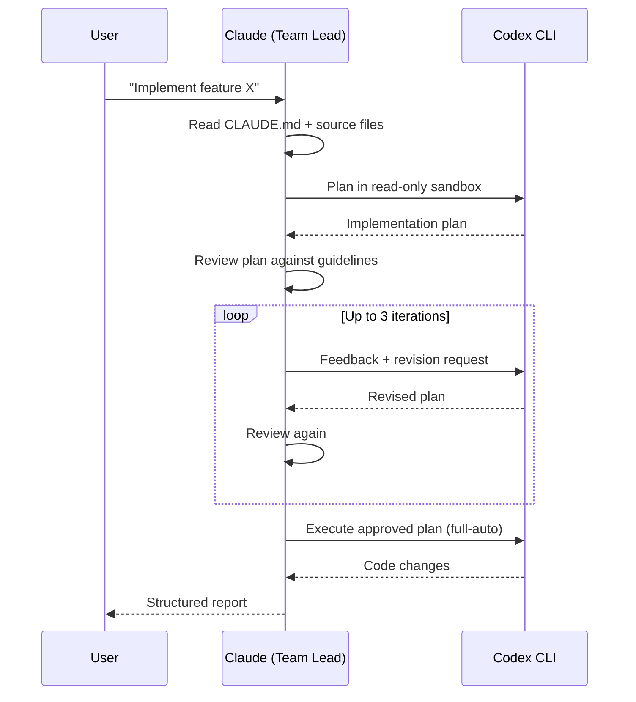
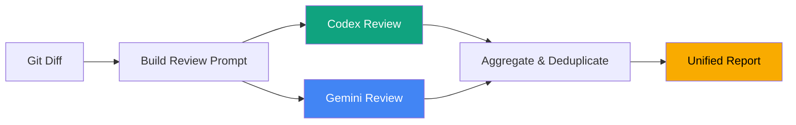
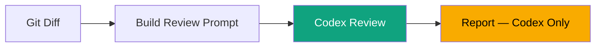

# codex-coder

Use Claude Code's agent teams to orchestrate OpenAI Codex coding agents — with structured plan-review loops and dual AI code review.

## The Idea

**Claude reasons. Codex generates. Gemini reviews.** (Gemini is optional.)

Claude Code acts as the team lead — it reads your codebase, understands your project guidelines, and delegates coding to Codex through structured plan-review loops. Before any PR is created, both Codex and Gemini (if available) review the changes in parallel, producing a unified report with severity-ranked findings.

You get Claude's architectural judgment directing Codex's code generation, with optional Gemini as a second pair of eyes.

## What's Included

| File | Type | Description |
|------|------|-------------|
| `agents/codex-coder.md` | Agent | Orchestrates Codex for coding tasks with iterative plan-review loops |
| `agents/ai-reviewer.md` | Agent | Runs dual code review (Codex required, Gemini optional) before PRs |
| `commands/codex-review.md` | Command | `/codex-review` — quick trigger for pre-PR code review |

## Architecture

### Workflow 1: Plan-Review Coding Loop

Claude delegates a coding task to Codex, reviews the plan, iterates on feedback, then lets Codex execute the approved plan.



### Workflow 2: Dual AI Code Review

Before creating a PR, both Codex and Gemini review your changes in parallel. Findings are deduplicated and ranked by severity.



When Gemini is unavailable, the agent automatically falls back to Codex-only mode — no configuration needed.



## Prerequisites

| Tool | Required | Install |
|------|----------|---------|
| [Claude Code](https://docs.anthropic.com/en/docs/claude-code) | Yes | `npm install -g @anthropic-ai/claude-code` |
| [Codex CLI](https://github.com/openai/codex) | Yes | `npm install -g @openai/codex` then `codex auth` |
| [Gemini CLI](https://github.com/google/gemini-cli) | No (optional) | `npm install -g @google/gemini-cli` |

Both agents auto-detect installed CLIs at runtime. If Codex is missing, they stop and guide you through setup. If Gemini is missing, the reviewer falls back to Codex-only mode.

## Installation

```bash
# Add the marketplace
claude plugin marketplace add rlraymondluo/codex-coder

# Install the plugin
claude plugin install codex-coder
```

Or clone directly:

```bash
cd ~/.claude/plugins
git clone https://github.com/rlraymondluo/codex-coder.git
```

## Usage

### Delegate a coding task to Codex

Use the `codex-coder` agent when you have a medium-to-large implementation task:

```
Use the codex-coder agent to implement the new authentication middleware.
Read the existing middleware patterns first, then have Codex plan and execute.
```

Claude will:
1. Gather project context from CLAUDE.md and source files
2. Send Codex a detailed planning prompt (read-only sandbox)
3. Review the plan, send feedback, iterate up to 3 times
4. Execute the approved plan (full-auto mode)
5. Return a structured report with changes and iteration metadata

### Run a pre-PR code review

Use the `/codex-review` command or invoke the `ai-reviewer` agent directly:

```
/codex-review
```

This will:
1. Capture the git diff of your changes
2. Build a rich review prompt with project context
3. Run Codex (and Gemini, if available) as reviewers
4. Produce a unified report with CRITICAL / IMPORTANT / SUGGESTION findings

### Add to your CLAUDE.md for automatic reviews

Add this to your project's `CLAUDE.md` to trigger reviews before every PR:

```markdown
## Code Review (MANDATORY)
- **Before creating any PR**: ALWAYS run the `ai-reviewer` agent for code review
- **For medium/large coding tasks**: Use the `codex-coder` agent with plan-review loop
```

## Configuration

### Model names

The agents use these models by default:

| Agent | Tool | Default Model |
|-------|------|---------------|
| codex-coder | Codex CLI | `gpt-5.3-codex` |
| ai-reviewer | Codex CLI | `gpt-5.3-codex` |
| ai-reviewer | Gemini CLI | `gemini-3-pro-preview` |

To change models, edit the `-m <model>` flags in the agent markdown files.

### Codex review subcommand

For PR reviews, the ai-reviewer uses `codex review --base main`. If your default branch is different, update the `--base` flag in `agents/ai-reviewer.md`.

## Example Output

### Code Review Report (Dual Mode)

```
## Dual AI Code Review Results

### CRITICAL (must fix before merge)
1. **SQL injection in user query** — `src/db/users.ts:42`
   - Reviewer(s): Both (HIGH CONFIDENCE)
   - Raw string interpolation in SQL query
   - Fix: Use parameterized queries

### IMPORTANT (strongly recommended)
1. **Missing error handling** — `src/api/auth.ts:15`
   - Reviewer(s): Codex
   - Token refresh can throw but isn't caught
   - Fix: Wrap in try/catch with retry logic

### SUGGESTIONS (nice to have)
1. **Unused import** — `src/utils/helpers.ts:3`
   - Reviewer(s): Gemini
   - `lodash` imported but never used
   - Fix: Remove the import

---
### Review Sources
- Codex (gpt-5.3-codex): 5 findings
- Gemini (gemini-3-pro-preview): 4 findings
- Overlapping (high confidence): 2 findings
```

## License

MIT — see [LICENSE](LICENSE) for details.
